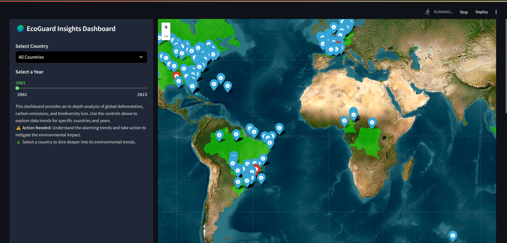
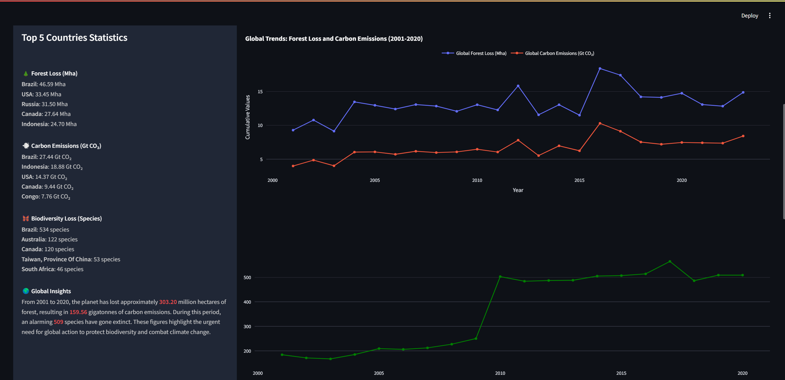
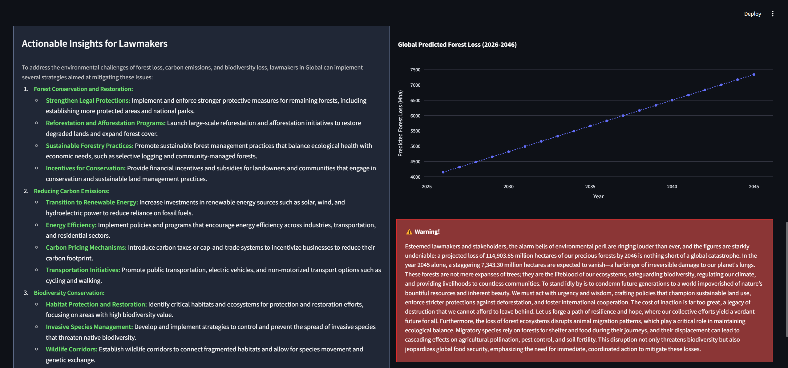

# Environmental Insights and Prediction Dashboard

## Overview
This application provides a comprehensive dashboard to analyze and visualize trends in deforestation, carbon emissions, and biodiversity loss across various countries. Leveraging historical data and predictive models, it enables users to:
- Monitor forest loss and carbon emissions globally or by country.
- Assess biodiversity trends with species extinction and endangerment data.
- Generate actionable insights for environmental decision-making.

## Features
- **Interactive Maps**: Visualize deforestation and species data with geo-referenced overlays.
- **Trend Predictions**: Predict future deforestation, carbon emissions, and biodiversity loss using machine learning.
- **Insights Generation**: Utilize GPT-based insights for policymakers and stakeholders.
- **Data Filtering**: Explore data for specific countries or global aggregates.

## Data Sources
- [Global Forest Watch](https://www.globalforestwatch.org/)
- [Mammal Diversity Database](https://mol.org/)

## Screenshots

### Interactive Map and Statistics


### Global Trends and Insights


### Actionable Insights


## Installation
1. Clone this repository:
   ```bash
   git clone https://github.com/your-repo-name/environmental-dashboard.git
   ```
2. Navigate to the project directory:
   ```bash
   cd environmental-dashboard
   ```
3. Install the required dependencies:
   ```bash
   pip install -r requirements.txt
   ```

## Usage
1. Run the Streamlit dashboard:
   ```bash
   streamlit run dashboard.py
   ```
2. Open your web browser at the provided URL to interact with the dashboard.

## File Structure
- `dashboard.py`: Entry point for the Streamlit application.
- `functions.py`: Core functions for data processing and visualization.
- `trend_prediction.py`: Predictive modeling using linear regression.
- `animal_species.py`: Data processing for biodiversity information.
- `data/`: Contains raw and processed data files (e.g., Excel and GeoJSON files).

## Key Components
### Data Loading
- **Deforestation Data**: Yearly tree cover loss and initial forest extent.
- **Carbon Emissions**: Annual gross emissions per country.
- **Biodiversity**: Population trends and extinction data.

### Predictive Models
- Linear regression models to forecast trends in:
  - Forest loss
  - Carbon emissions
  - Biodiversity loss

### Insights Generation
- Uses OpenAI's GPT to generate recommendations for stakeholders based on environmental trends.

## How It Works
1. **Data Processing**: Load and clean data for deforestation, carbon emissions, and species trends.
2. **Visualization**: Use Folium for maps and Plotly for trend charts.
3. **Prediction**: Train and apply machine learning models to forecast trends.
4. **Interactive Elements**: Provide users with country selection, year filtering, and detailed popups.

## Example Insights
- "In Brazil, the predicted forest loss from 2026 to 2046 amounts to 20 Mha, with significant carbon emissions. Immediate reforestation policies and carbon sequestration initiatives are recommended."

## Contribution
Contributions are welcome! Please fork the repository, create a feature branch, and submit a pull request.

## License
This project is licensed under the MIT License. See the `LICENSE` file for details.

---

### Contact
For questions or support, please email [basma1707@gmail.com].
